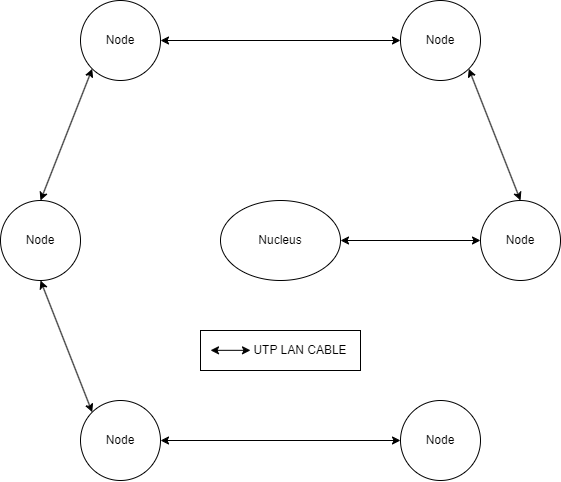

# MRBR Topology

## Description

The MRBR topology is quiet simple. The central unit is the Nucleus. Around the Nucleus with have severals Nodes, connected to the Nucleus through a Local Area network. Thus, the Nucleus acts as a router, managing the network and giving IP addresses to the Nodes. 
As MRBR use the MQTT Protocol to realize the communication between the Nodes and the Nucleus, this last also acts as MQTT Broker delivering the commands via MQTT messages.

## Devices

### Nucleus :
The MRBR Nucleus is the central unit of the topology as it is from it that user commands are sent to the nodes.
The Nucleus is based on Raspberry Pi Compute Module 4 with 16GB of eMMC, 2GB of RAM and the WiFi and Bluetooth module embedded.
The Nucleus exposes a certain amount of Inputs and Outputs in order to perform its tasks : 
- GPIO : The GPIO can be used to add a physical control panel to the layout letting anyone design its own.
- RJ45/Ethernet Connectors : These are the interfaces to the Local Area Network (LAN) managed by the Nucleus. All the Nodes are connected between them and to the Nucleus through this.
- POWER OUT : This is the power distribution output for all the nodes on the layout.
- DISPLAY : If you don't want to use a custom Control Panel nor the MRBR App, you could also integrate a touch screen to the setup (via HDMI or DSI).

## Node :
The MRBR Node is the local unit of the layout. After receiving some commands, it will perfom such tasks as :
- Control the power tracks attached to it (1 for the Mono-Node and until 4 for the Quad-Node)
- Control the switch tracks attached to it (until 4)
- Control traffic lights and scenary lights (Quad-Node or A-Node only)
- Receive triggers from sensor on the layout to perform some automated tasks

## A-Node : 
The A(ccessory)-Node is, as its name stand it, controls accessory such as lights, animation and so on.