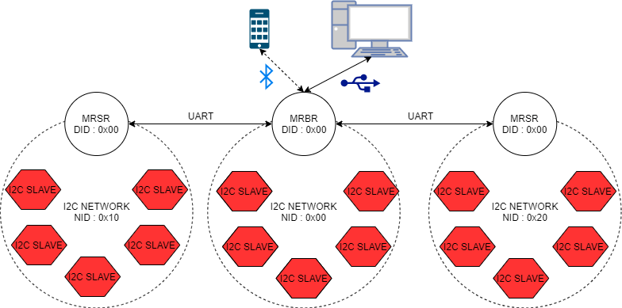
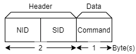

# The Model Railroad Bluetooth Router Project

## Why this project?
I recently started this project in order to control my old Marklin Model Railroad (M tracks) or, at least, some parts of it (such as the switch tracks, some parts of the diorama, crossing, etc).

This project is inspired of the URB project (https://arduinorailwaycontrol.com/) that I will not explain here, go check this website, the project is super cool.

I wanted to create a similar concept that Mr Massiker (Founder of URB) did but with my point of view and that's what I did.

## What's the MRBR?
For now, it is nothing else than an idea (and some schematics, PCB files and a bit of Arduino code).

The idea is to have an ESP32 that will communicate Wirelessly or Wiredly (I'm not sure these words exist in English) with a control device (Smartphone, PC, ...).

This control peripheral (CP) will send command to the ESP32 that will do several thing with it:

First, the MRBR checks the Network ID (NID) included in the header of the command.
Then it will deal with it following 2 cases :

##### Case A : The NID from the command doesn't match the NID of the MRBR
1. The MRBR will search in its routing table to find a matching router for this NID.
2. The command will then be forwarded to the right router that will deliver the command to the Peripheral Controler (PCtrl) matching the I2C address (DID) included in the header.

##### Case B : The NID from the command match with the NID of the MRBR
The command will then be forwarded to the right PCtrl matching the DID included in the header.

These NID and DID are just some hex value (typically a byte) such as the command.

The MRBR works mostely like a LAN Network but with the I2C and UART protocols. Every router of the project (MRBR or MRSR) have their own I2C "Network"(see diagram below). The MRBR and the MRSR communicate via UART together. And each router communicate with its network using I2C protocol.

The MRBR command frame is illustrated in the next picture.

To achieve this I use the 2 cores of the ESP32-WROOM32D as the Core \#0 handles the IO peripherals and the Core \#1 handles the communications (Bluetooth, UART, I2C).

## Current status of the Project
For now, at the time of writing these lines, I'm finishing the design of the V1 for both MRBR and MRSR.
I've hope to test them maybe next month (after a bit of soldering process).

About the code, I started to work on it but didn't have much time to work on it. It is, however, available in the dev branch of this repository. Have fun!

# This project is completely Open Source so don't hesitate to participate to the code part and to give me your feedback about the schematics. :D
